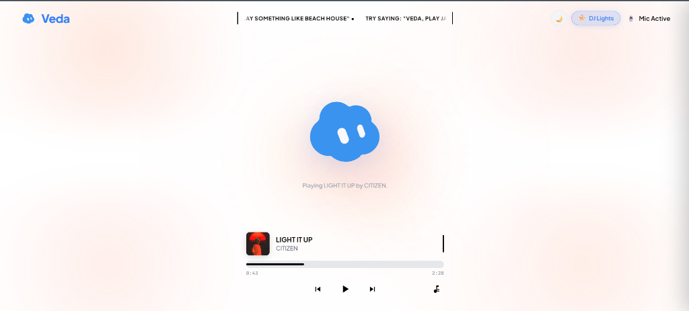
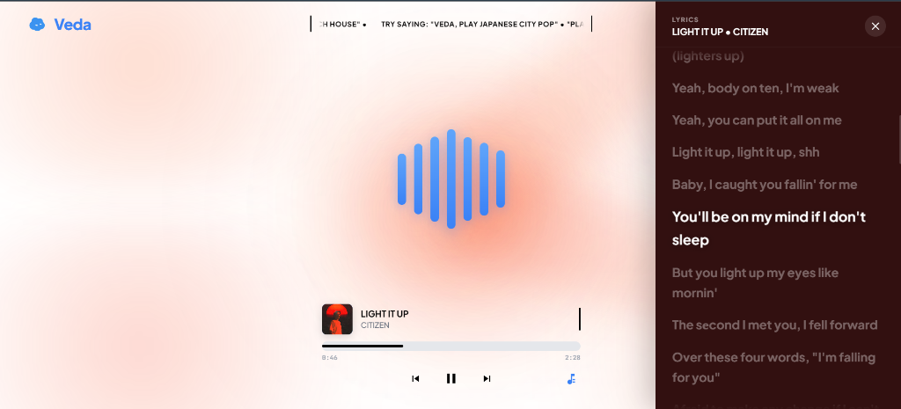
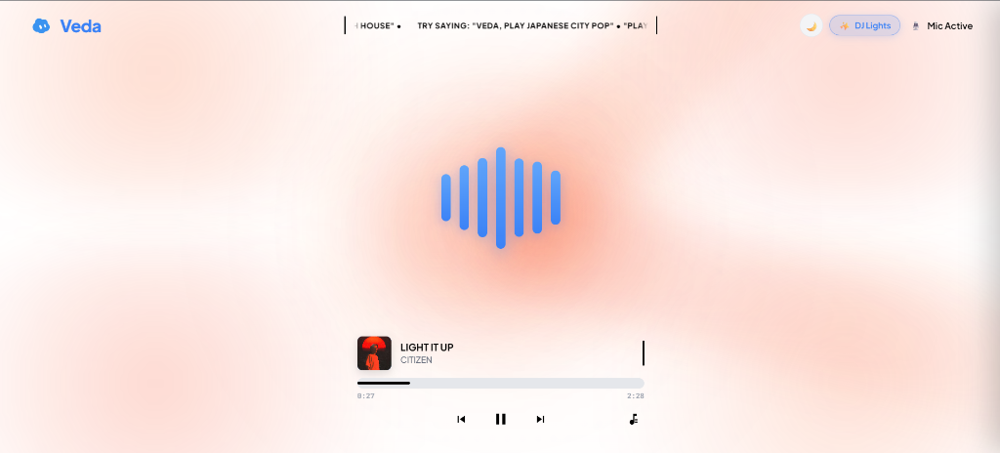

# VEDA • Music AI & Interactive Voice Studio

<div align="center">
  
  <br>
  <br>

[](LICENSE)
[](https://nodejs.org)
[](https://github.com/Ish-xo/Veda)

  <p><em>An intelligent, voice-controlled music player and conversational AI studio.</em></p>
</div>

---

## 📸 Visual Showcase

<div align="center">
  <h3>🎙️ Voice-Ready Idle Stage & Avatar</h3>
  
  <br><br>
  
  <h3>✨ Live Audio Waveform Visualizer & DJ Lights</h3>
  
  <br><br>
  
  <h3>🎵 Spotify-Style Synchronized Lyrics</h3>
  
</div>

---

## ✨ Features & Architecture

### 1. 🎙️ Intelligent Voice AI & Low-Pitch Sensitivity
- **Broad Phonetic Wake Detection**: Say *"Hey Veda"* or *"Veda"* in any tone, dialect, whisper, or deep low-pitch voice.
- **Hardware AGC (Auto Gain Control)**: Leverages browser hardware gain adjustments to boost low frequencies and ensure quiet commands are transcribed accurately.
- **Instant Voice Barge-In (< 15ms)**: Saying *"Hey Veda"* in the middle of a song instantly pauses YouTube playback, rings the acoustic wake chime, and transitions smoothly into listening mode.
- **Concise Spoken Responses**: Veda delivers warm, broadcast-quality spoken announcements powered by Edge Neural TTS (`en-US-AvaNeural`) with WebSpeech API resilience.

### 2. 🎆 Fullscreen Ambient DJ Party Lights & Cover Art Sync
- **Edge-to-Edge Stage Illumination**: Four corner ambient washes (`washTL`, `washTR`, `washBL`, `washBR`), central luminescence orbs, and sweeping laser beams.
- **Dynamic Cover Art Color Extraction (`extractCoverArtColors`)**: Automatically analyzes active track artwork (`track.thumbnail`) and adapts ambient light gradients to match each song's unique color palette live.
- **Audio-Reactive Beat Modulation**: Real-time frequency analysis dynamically pulses orbs, beams, and washes in sync with live bass, mids, and treble.
- **Crystal Clear Aesthetic**: High-clarity radial diffusion designed to eliminate foggy center smudges.

### 3. 🌓 Dark Mode & Single-Screen UI
- **Navbar Theme Switcher**: Instant toggle between crisp Pure White theme and obsidian Dark Mode (`#070b14`) with `localStorage` persistence.
- **Bounded Scrolling Marquee**: Center ticker bounded by vertical delimiter lines displaying command suggestions.
- **Dynamic Stage View Swap**:
  - **Paused State**: Veda Avatar (clickable for manual wake-up).
  - **Playing State**: 7 rounded audio waveform bars bouncing rhythmically to live audio.
- **Player Deck**: Bounded track metadata, seek bar, time labels, and playback controls.

### 4. 🎵 Spotify-Style Synchronized Lyrics
- Slide-out lyrics panel powered by LRCLIB with line-by-line synchronized scrolling.
- Click any lyric line to seek directly to that timestamp in the track.
- Dynamic background color matched to the current track's extracted cover art palette.

---

## 🚀 Quick Start

### 1. Prerequisites
- [Node.js](https://nodejs.org/) (version 18 or higher recommended)
- A modern web browser with microphone access (Chrome, Edge, Brave, Firefox)

### 2. Clone Repository
```bash
git clone https://github.com/Ish-xo/Veda.git
cd Veda
```

### 3. Install Dependencies
```bash
npm install
```

### 4. Start the Application
```bash
npm start
```
*(or `npm run dev` for auto-reloading)*

### 5. Launch in Browser
Open [http://localhost:3000](http://localhost:3000) in your browser. Click **Enter** on the intro screen to unlock the studio.

---

## 🗣️ Voice Commands & Interactions

| Command | Action |
| :--- | :--- |
| `"Hey Veda, play Starboy"` | Plays the requested song with concise spoken intro |
| `"Veda, play Japanese City Pop"` | Searches and streams the genre |
| `"Play something"` / `"Play music"` | Streams a trending song |
| `"Pause"` / `"Stop music"` | Pauses current playback |
| `"Resume"` / `"Unpause"` | Resumes playback |
| `"Next song"` / `"Skip"` | Skips to the next track |
| `"Forward 10 seconds"` | Seeks forward by 10s |
| `"Rewind 10 seconds"` | Seeks backward by 10s |
| `"Skip intro"` | Seeks ahead by 15s |

---

## ⌨️ Keyboard Shortcuts

- `Space`: Play / Pause playback
- `Arrow Right`: Seek forward 10 seconds
- `Arrow Left`: Seek rewind 10 seconds
- `Key L`: Toggle Spotify-style Synced Lyrics drawer
- `Key V`: Trigger manual voice wake-up
- `Escape`: Close open drawers and panels

---

## 🛠️ Project Structure

```
├── public/
│   ├── index.html         # Main single-screen application markup & theme loader
│   ├── css/
│   │   └── style.css      # Design system, light/dark themes, DJ lights & layout
│   ├── js/
│   │   ├── app.js         # Core orchestrator, theme manager & cover art extractor
│   │   ├── audio-engine.js# Web Audio API, YouTube player & visualizer engine
│   │   └── speech-engine.js# Low-pitch STT, AGC booster & phonetic wake detector
│   └── svg/               # Brand assets & Veda avatar graphics
├── assets/
│   └── screenshots/       # Screenshots for visual showcase
├── server.js              # Express backend, YouTube music search, Edge TTS & lyrics API
├── test-e2e.js            # Automated end-to-end test suite (12 suites, 100% coverage)
├── package.json           # Project dependencies & scripts
└── README.md              # Project documentation
```

---

## 🧪 Testing

Run the automated test suite verifying all 12 endpoints, intents, theme switching, and visualizer elements:

```bash
node test-e2e.js
```

---

## 📄 License

This project is licensed under the MIT License.
